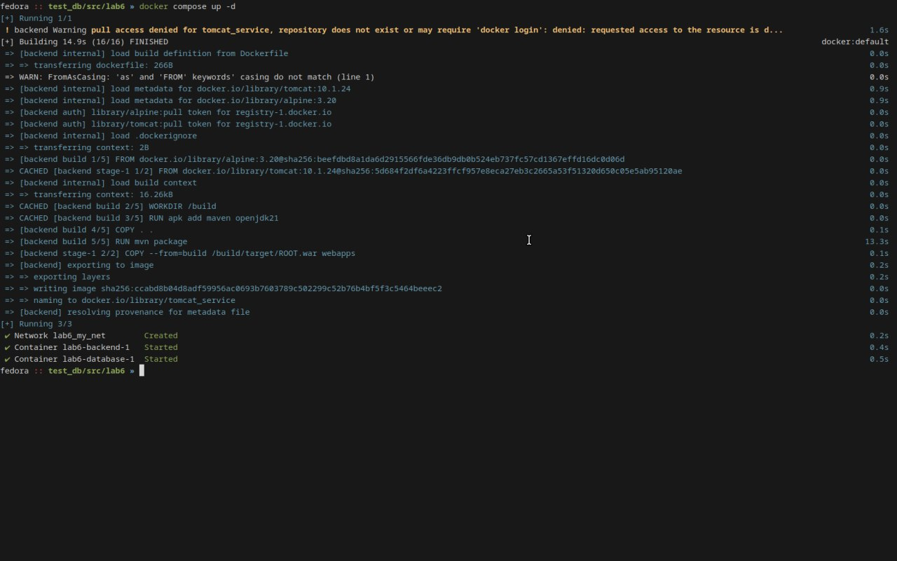
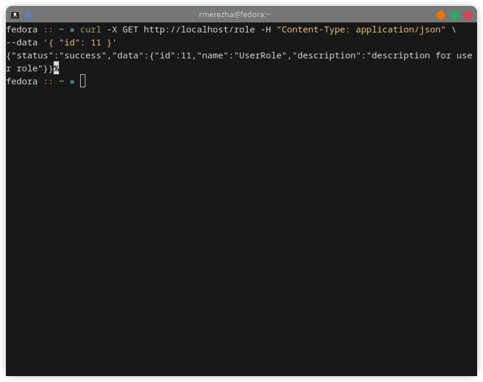
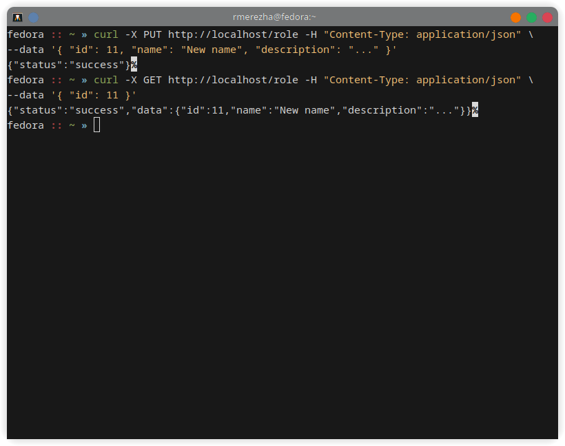
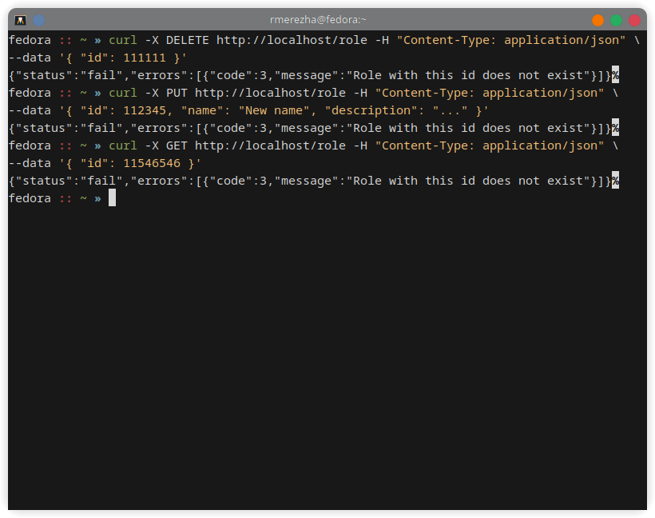
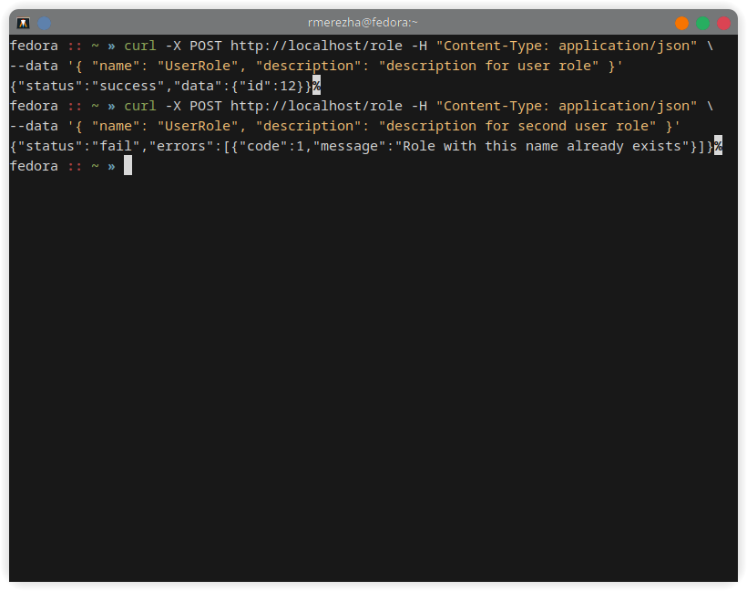
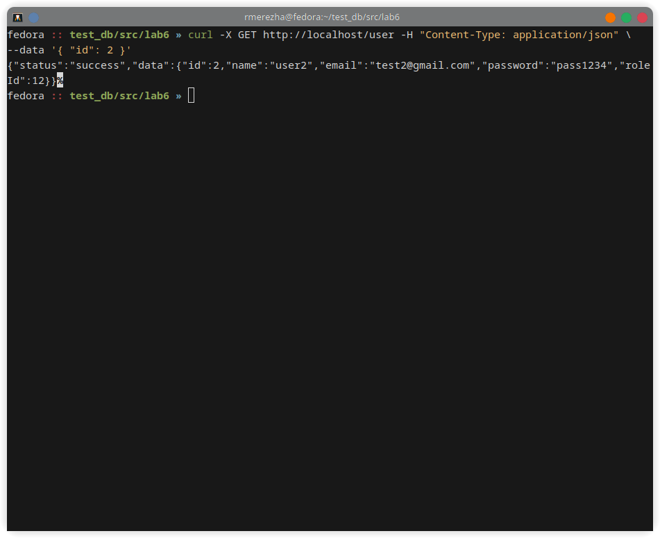
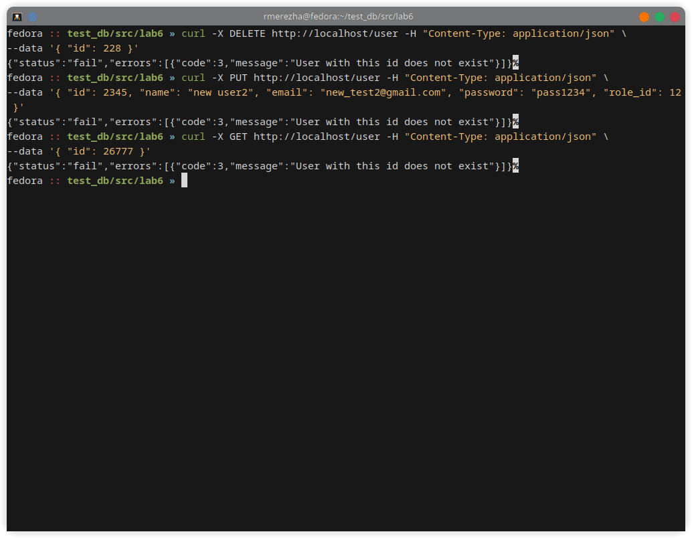
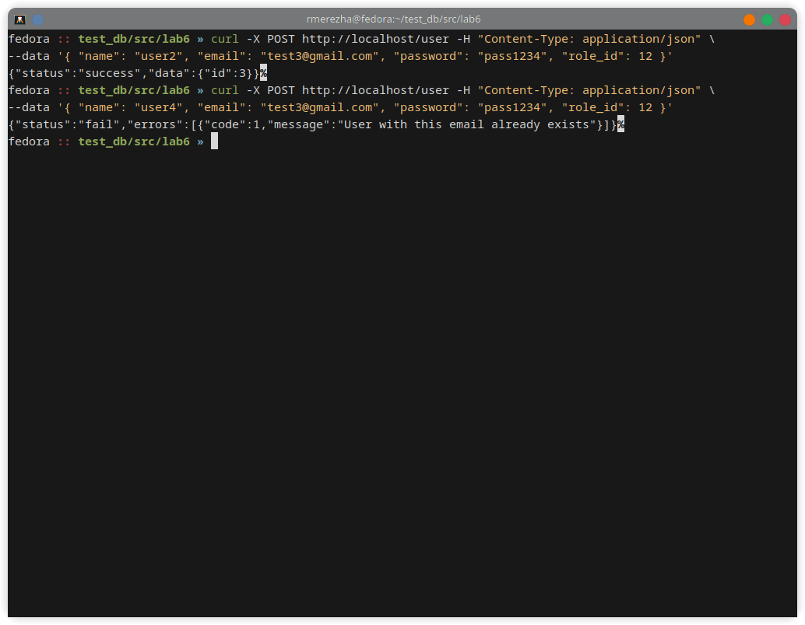

# Тестування працездатності системи

## Configure the server and database using Docker and Docker Compose

### Dockerfile

```Dockerfile
FROM alpine:3.20 as build

WORKDIR /build

RUN apk add maven openjdk21

COPY . .

RUN mvn package

FROM tomcat:10.1.24

COPY --from=build /build/target/ROOT.war webapps
```

### compose.yaml

```yaml
name: lab6

services:
  backend:
    image: tomcat_service
    build:
      context: .
      dockerfile: Dockerfile
    ports:
      - "80:8080"
    networks:
      - my_net
    restart: always

  database:
    image: mysql:9.1.0
    environment:
      - MYSQL_ROOT_PASSWORD=pass
    volumes:
      - mysql_data:/var/lib/mysql
    networks:
      - my_net

volumes:
  mysql_data:
    external: true

networks:
  my_net:
    driver: bridge
```

### Run Docker Compose to start the services

<p align="center">
    
</p>

## Tests

### POST /role

<p align="center">
    
</p>

### GET /role

<p align="center">
    
</p>


### PUT /role

<p align="center">
    
</p>


### DELETE /role

<p align="center">
    
</p>


### PUT/GET/DELETE /role with wrond id (ERROR)

<p align="center">
    
</p>


### POST /role with a non-unique name (ERROR)

<p align="center">
    
</p>

### POST /user

<p align="center">
    
</p>

### GET /user

<p align="center">
    
</p>


### PUT /user

<p align="center">
    
</p>


### DELETE /user

<p align="center">
    
</p>


### PUT/GET/DELETE /user with wrond id (ERROR)

<p align="center">
    
</p>


### POST /user with a non-unique email (ERROR)

<p align="center">
    
</p>

